# Nintendo 64 Games — A Section

Explore all N64 titles starting with the letter A, from *A Bug’s Life* to *Automobili Lamborghini*.

|  | <a href="a/aero-fighters-assault">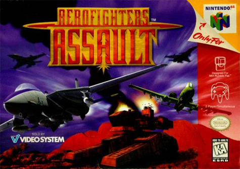</a> |
|---|---|
| [A Bug’s Life](a/a-bugs-life) | [Aero Fighters Assault](a/aero-fighters-assault) |

| <a href="a/aerogauge">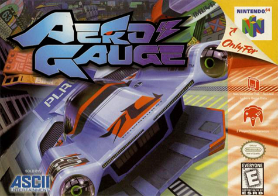</a> |  |
|---|---|
| [AeroGauge](a/aerogauge) | [AI Shogi 3](a/ai-shogi-3) |

| <a href="a/aidyn-chronicles-the-first-mage">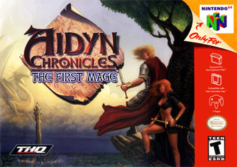</a> | <a href="a/air-boarder-64">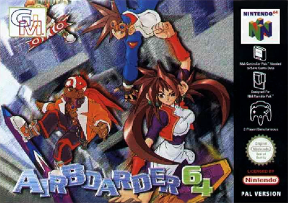</a> |
|---|---|
| [Aidyn Chronicles: The First Mage](a/aidyn-chronicles) | [Air Boarder 64](a/air-boarder-64) |

|  | <a href="a/akumajou-dracula-gaiden">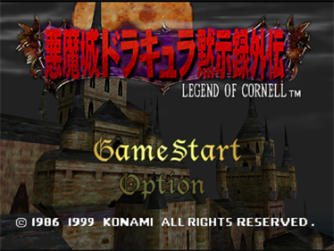</a> |
|---|---|
| [Akumajou Dracula Mokushiroku](a/akumajou-dracula) | [Akumajou Dracula Mokushiroku Gaiden](a/akumajou-dracula-gaiden) |

|  | <a href="a/all-star-baseball-2000">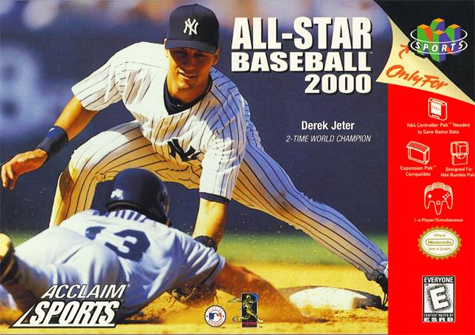</a> |
|---|---|
| [All Star Tennis ’99](a/all-star-tennis-99) | [All-Star Baseball 2000](a/all-star-baseball-2000) |

| <a href="a/all-star-baseball-2001">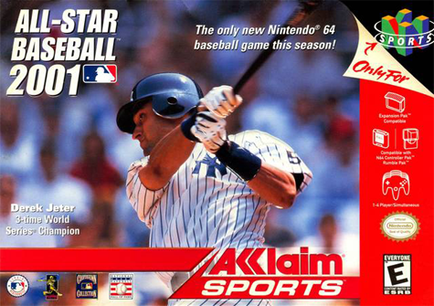</a> |  |
|---|---|
| [All-Star Baseball 2001](a/all-star-baseball-2001) | [All-Star Baseball 99](a/all-star-baseball-99) |

| <a href="a/animal-crossing">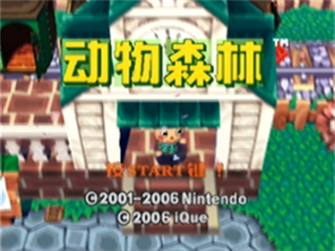</a> | <a href="a/armorines">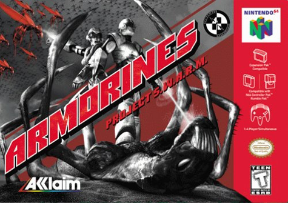</a> |
|---|---|
| [Animal Crossing (iQue Player)](a/animal-crossing) | [Armorines Project S.W.A.R.M.](a/armorines) |

| <a href="a/army-men-air-combat">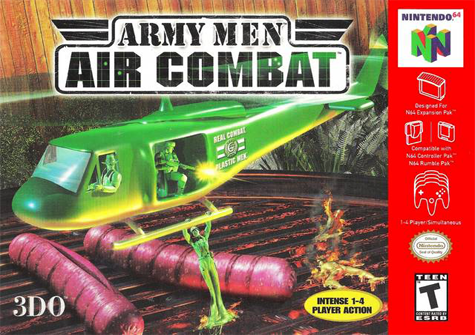</a> |  |
|---|---|
| [Army Men: Air Combat](a/army-men-air-combat) | [Army Men: Sarge’s Heroes](a/army-men-sarges-heroes) |

|  | <a href="a/asteroids-hyper-64">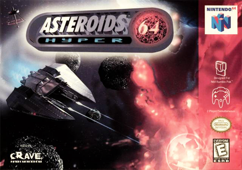</a> |
|---|---|
| [Army Men: Sarge’s Heroes 2](a/army-men-sarges-heroes-2) | [Asteroids Hyper 64](a/asteroids-hyper-64) |

| <a href="a/automobili-lamborghini">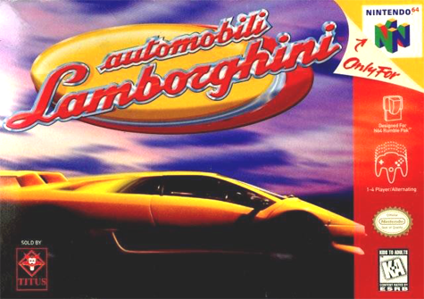</a> |  |
|---|---|
| [Automobili Lamborghini / Super Speed Race 64](a/automobili-lamborghini) |  |
