# Nintendo 64 Games — B Section

Explore all N64 titles starting with the letter B, from *Baku Bomberman* to *Bust-A-Move 3 DX*.

| <a href="b/baku-bomberman">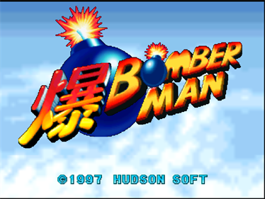</a> | <a href="b/baku-bomberman-2">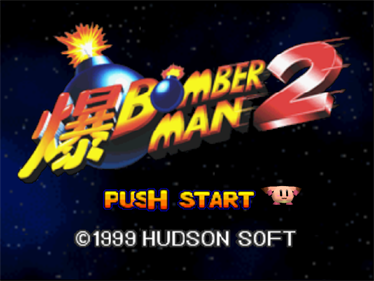</a> |
|---|---|
| [Baku Bomberman](b/baku-bomberman) | [Baku Bomberman 2](b/baku-bomberman-2) |

| <a href="b/bakuretsu-muteki-bangai-o">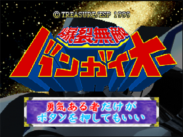</a> | <a href="b/bakusho-jinsei-64-mezase-resort-o">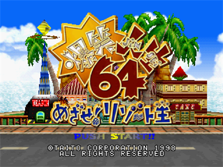</a> |
|---|---|
| [Bakuretsu Muteki Bangai-O](b/bakuretsu-muteki-bangai-o) | [Bakusho Jinsei 64](b/bakusho-jinsei-64-mezase-resort-o) |

| <a href="b/banjo-kazooie">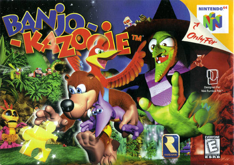</a> | <a href="b/banjo-tooie">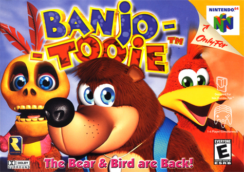</a> |
|---|---|
| [Banjo-Kazooie](b/banjo-kazooie) | [Banjo-Tooie](b/banjo-tooie) |

| <a href="b/bass-hunter-64">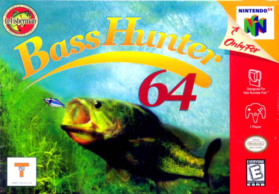</a> | <a href="b/bass-masters-2000">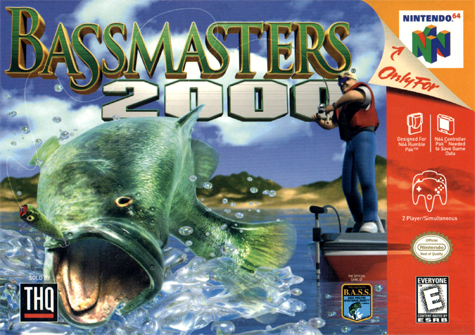</a> |
|---|---|
| [Bass Hunter 64](b/bass-hunter-64) | [Bass Masters 2000](b/bass-masters-2000) |

| <a href="b/bass-rush-ecogear-powerworm-championship">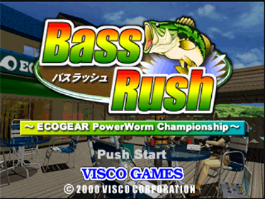</a> | <a href="b/batman-beyond-return-of-the-joker">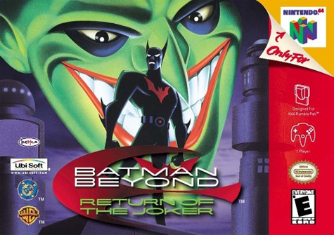</a> |
|---|---|
| [Bass Rush: ECOGEAR Powerworm Championship](b/bass-rush-ecogear-powerworm-championship) | [Batman Beyond: Return of the Joker](b/batman-beyond-return-of-the-joker) |

| <a href="b/batman-beyond-return-of-the-joker">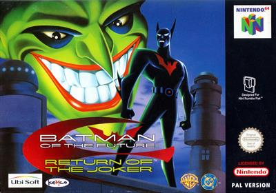</a> | <a href="b/battle-tanx">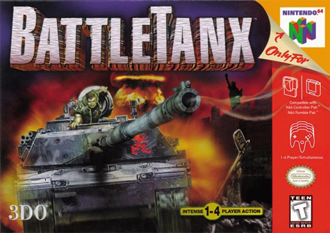</a> |
|---|---|
| [Batman of the Future: Return of the Joker](b/batman-beyond-return-of-the-joker) | [BattleTanx](b/battle-tanx) |
| <a href="b/battle-tanx-global-assault">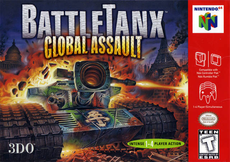</a> | <a href="b/battlezone-rise-of-the-black-dogs">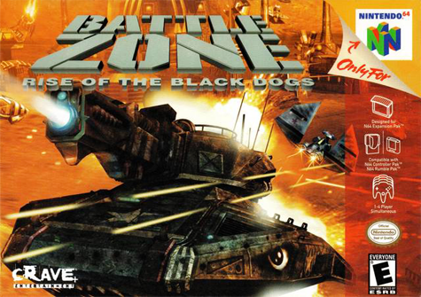</a> |
|---|---|
| [BattleTanx: Global Assault](b/battletanx-global-assault) | [Battlezone: Rise of the Black Dogs](b/battlezone-rise-of-the-black-dogs) |

| <a href="b/beetle-adventure-racing">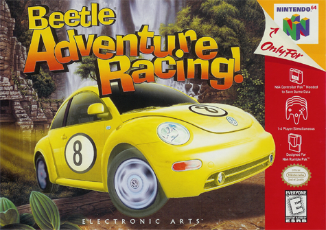</a> | <a href="b/big-mountain-2000">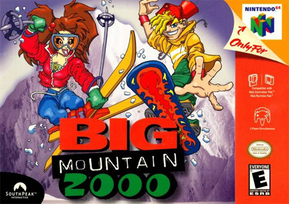</a> |
|---|---|
| [Beetle Adventure Racing](b/beetle-adventure-racing) | [Big Mountain 2000](b/big-mountain-2000) |

| <a href="b/bio-freaks">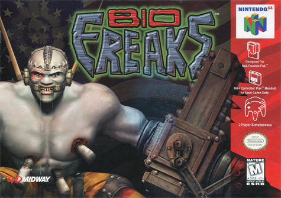</a> | <a href="b/biohazard-2-resident-evil-2">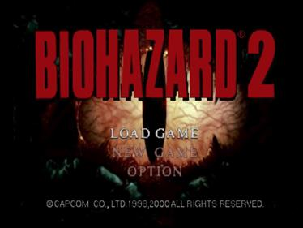</a> |
|---|---|
| [Bio F.R.E.A.K.S.](b/bio-freaks) | [Biohazard 2 / Resident Evil 2](b/biohazard-2-resident-evil-2) |

| <a href="b/blast-corps">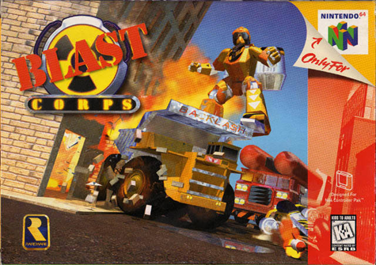</a> | <a href="b/blues-brothers-2000">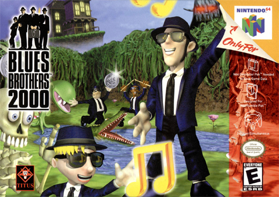</a> |
|---|---|
| [Blast Corps / Blast Dozer](b/blast-corps) | [Blues Brothers 2000](b/blues-brothers-2000) |
| <a href="b/body-harvest">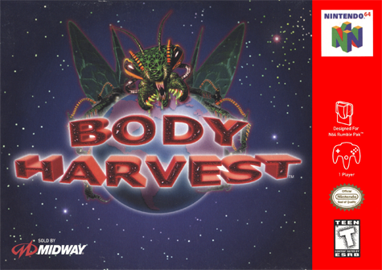</a> | <a href="b/harvest-moon-64-bokuj-monogatari-2">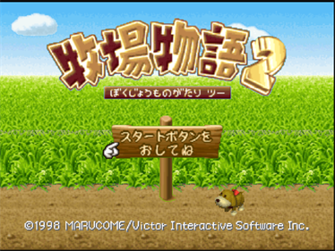</a> |
|---|---|
| [Body Harvest](b/body-harvest) | [Bokujō Monogatari 2](b/harvest-moon-64-bokuj-monogatari-2) |

| <a href="b/baku-bomberman">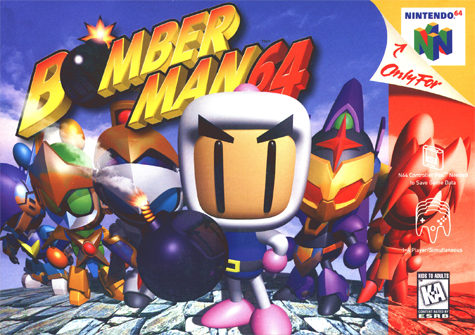</a> | <a href="b/bomberman-64-arcade-edition">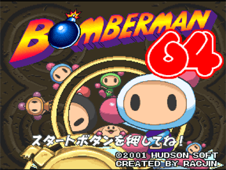</a> |
|---|---|
| [Bomberman 64](b/baku-bomberman) | [Bomberman 64: Arcade Edition](b/bomberman-64-arcade-edition) |

| <a href="b/baku-bomberman-2">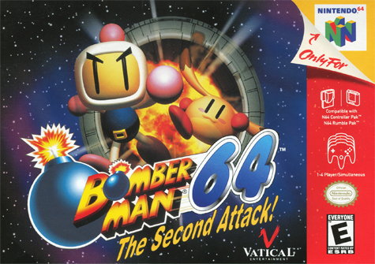</a> | <a href="b/bomberman-hero">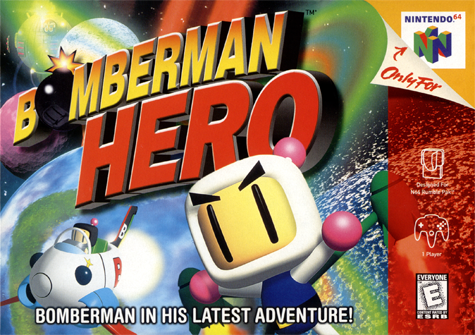</a> |
|---|---|
| [Bomberman 64: The Second Attack](b/baku-bomberman-2) | [Bomberman Hero](b/bomberman-hero) |

| <a href="b/bottom-of-the-9th">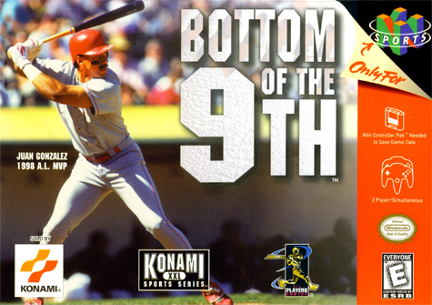</a> | <a href="b/brunswick-circuit-pro-bowling">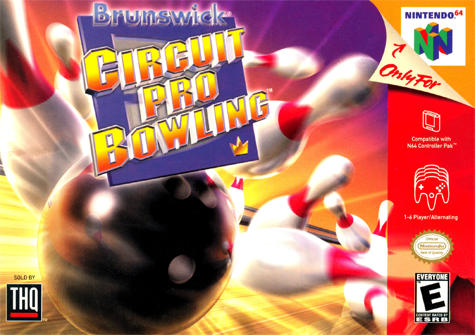</a> |
|---|---|
| [Bottom of the 9th](b/bottom-of-the-9th) | [Brunswick Circuit Pro Bowling](b/brunswick-circuit-pro-bowling) |

| <a href="b/buck-bumble">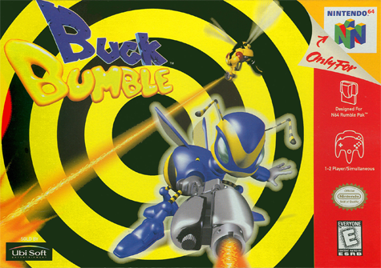</a> | <a href="b/bust-a-move-2-arcade-edition.">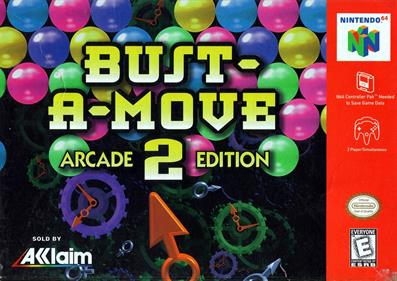</a> |
|---|---|
| [Buck Bumble](b/buck-bumble) | [Bust-A-Move 2: Arcade Edition](b/bust-a-move-2-arcade-edition) |

| <a href="b/bust-a-move-99">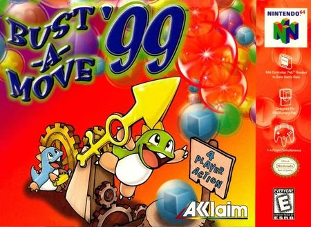</a> | <a href="b/bust-a-move-99">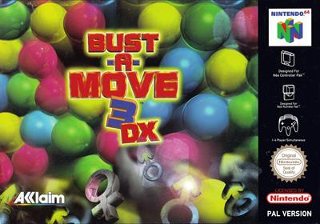</a> |
|---|---|
| [Bust-A-Move ’99](b/bust-a-move-99) | [Bust-A-Move 3 DX](b/bust-a-move-99) |
