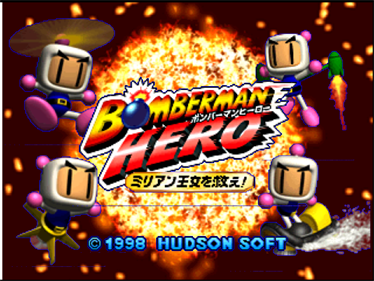

# Nintendo 64 Games — B Section

Explore all N64 titles starting with the letter B, from *Baku Bomberman* to *Bust-A-Move 99*.

|  |  |
|---|---|
| [Baku Bomberman](b/baku-bomberman) | [Baku Bomberman 2](b/baku-bomberman-2) |

|  |  |
|---|---|
| [Bakuretsu Muteki Bangai-O](b/bakuretsu-muteki-bangai-o) | [Bakusho Jinsei 64](b/bakusho-jinsei-64) |

|  |  |
|---|---|
| [Banjo-Kazooie](b/banjo-kazooie) | [Banjo-Tooie](b/banjo-tooie) |

|  |  |
|---|---|
| [Bass Hunter 64](b/bass-hunter-64) | [Bass Masters 2000](b/bass-masters-2000) |

|  |  |
|---|---|
| [Bass Rush: ECOGEAR Powerworm Championship](b/bass-rush-ecogear-powerworm-championship) | [Batman Beyond: Return of the Joker](b/batman-beyond) |

|  |  |
|---|---|
| [BattleTanx](b/battletanx) | [BattleTanx: Global Assault](b/battletanx-global-assault) |

|  |  |
|---|---|
| [Battlezone: Rise of the Black Dogs](b/battlezone) | [Beetle Adventure Racing](b/beetle-adventure-racing) |
|  |  |
|---|---|
| [Big Mountain 2000](b/big-mountain-2000) | [Bio F.R.E.A.K.S.](b/bio-freaks) |

|  |  |
|---|---|
| [Biohazard 2](b/biohazard-2) | [Blast Corps](b/blast-corps) |

|  |  |
|---|---|
| [Blues Brothers 2000](b/blues-brothers-2000) | [Body Harvest](b/body-harvest) |

|  |  |
|---|---|
| [Bokujō Monogatari 2](b/bokujo-monogatari-2) | [Bomberman 64](b/bomberman-64) |

|  |  |
|---|---|
| [Bomberman 64: Arcade Edition](b/bomberman-64-arcade-edition) | [Bomberman 64: The Second Attack](b/bomberman-64-second-attack) |

|  |  |
|---|---|
| [Bomberman Hero](b/bomberman-hero) | [Bottom of the 9th](b/bottom-of-the-9th) |
|  |  |
|---|---|
| [Brunswick Circuit Pro Bowling](b/brunswick-circuit-pro-bowling) | [Buck Bumble](b/buck-bumble) |

|  |  |
|---|---|
| [Bust-A-Move 2: Arcade Edition](b/bust-a-move-2) | [Bust-A-Move ’99](b/bust-a-move-99) |

|  |  |
|---|---|
| [Bust-A-Move 3 DX](b/bust-a-move-3-dx) | [Puzzle Bobble 64](b/puzzle-bobble-64) |
