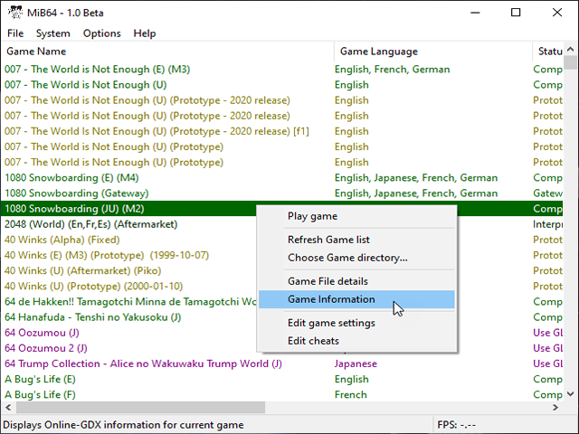
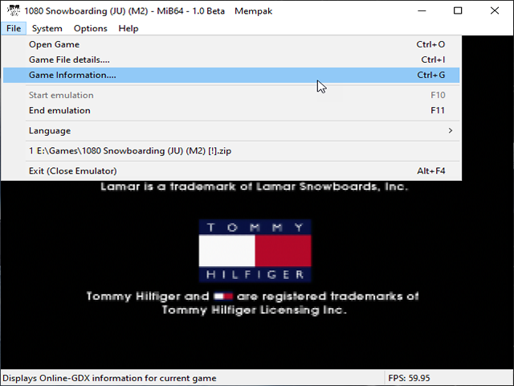

# Online GDX (Game Database eXtra)
 
	
N64 Gamespedia is a dedicated N64 Game information database for emulators to hook into,

and display the information via their project.

  

    
  

  

    
  

<strong>Hover to zoom</strong>

<!-- ClauseEcho: mib_game_information_1 & mib_game_information_2 Interactive Images -->

Currently MiB64 has our service integrated into its Game Browser and File/Game Information, giving it's users our exclusive content to assist them whilst playing their favourite games.

If you would like to look around, please make a selection by using the above navigation menu. You can then navigate to your desired game information.

 
