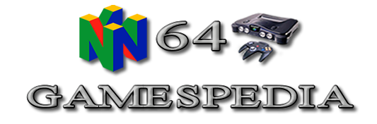

# Welcome to N64Gamespedia Github Version

 
 

Welcome to the  N64Gamespedia Github version of the Online GDX (Game Database eXtra).

Explore classic N64 titles using the sidebar or the [N64Gamespedia Index](index#n64gamespedia-index) below. 🎮

 

---

# N64Gamespedia Index

## 0–9
- [007: The World Is Not Enough](numbered/007-the-world-is-not-enough)
- [007: The World Is Not Enough (Prototype 2020)](numbered/007-twine-prototype-2020)
- [1080° Snowboarding](numbered/1080-snowboarding)
- [40 Winks](numbered/40-winks)
- [64 de Hakken!! Tamagotchi: Minna de Tamagotchi World](numbered/64-de-hakken-tamagotchi)
- [64 Hanafuda: Tenshi no Yakusoku](numbered/64-hanafuda)
- [64 Ozumo](numbered/64-ozumo)
- [64 Ozumo 2](numbered/64-ozumo-2)
- [64 Trump Collection: Alice no Waku Waku Trump World](numbered/64-trump-collection)

## A
- [A Bug’s Life](a/a-bugs-life)
- [Aero Fighters Assault](a/aero-fighters-assault)
- [AeroGauge](a/aerogauge)
- [AI Shogi 3](a/ai-shogi-3)
- [Aidyn Chronicles: The First Mage](a/aidyn-chronicles-the-first-mage)
- [Air Boarder 64](a/air-boarder-64)
- [Akumajou Dracula Mokushiroku](a/akumajou-dracula-mokushiroku)
- [Akumajou Dracula Mokushiroku Gaiden](a/akumajou-dracula-gaiden)
- [All Star Tennis ’99](a/all-star-tennis-99)
- [All-Star Baseball 2000](a/all-star-baseball-2000)
- [All-Star Baseball 2001](a/all-star-baseball-2001)
- [All-Star Baseball 99](a/all-star-baseball-99)
- [Animal Crossing (iQue Player)](a/animal-crossing)
- [Armorines Project S.W.A.R.M.](a/armorines-project-swarm)
- [Army Men: Air Combat.](a/army-men-air-combat)
- [Army Men: Sarge’s Heroes](a/army-men-sarges-heroes)
- [Army Men: Sarge’s Heroes 2](a/army-men-sarges-heroes-2)
- [Asteroids Hyper 64](a/asteroids-hyper-64)
- [Automobili Lamborghini](a/automobili-lamborghini)

## B
- [Baku Bomberman / Bomberman 64](b/baku-bomberman)
- [Baku Bomberman 2 / Bomberman 64: The Second Attack](b/baku-bomberman-2)
- [Bakuretsu Muteki Bangai-O](bakuretsu-muteki-bangai-o)
- [Bakusho Jinsei 64: Mezase! Resort-O](b/bakusho-jinsei-64-mezase-resort-o)
- [Banjo-Kazooie / Banjo to Kazooie no Daiboken](b/banjo-kazooie)
- [Banjo-Tooie / Banjo to Kazooie no Daiboken 2](b/banjo-tooie)
- [Bass Hunter 64 / In-Fisherman Bass Hunter 64](b/bass-hunter-64)
- [Bass Masters 2000](b/bass-masters-2000)
- [Bass Rush: ECOGEAR Powerworm Championship](b/bass-rush-ecogear-powerworm-championship)
- [Batman Beyond / Batman of the Future: Return of the Joker](b/batman-beyond-return-of-the-joker)
- [BattleTanx](b/battle-tanx)
- [BattleTanx: Global Assault](b/battletanx-global-assault)
- [Battlezone: Rise of the Black Dogs](b/battlezone-rise-of-the-black-dogs)
- [Beetle Adventure Racing](b/beetle-adventure-racing)
- [Big Mountain 2000 / Snow Speeder](b/big-mountain-2000)
- [Bio F.R.E.A.K.S.](b/bio-freaks)
- [Biohazard 2](b/biohazard-2-resident-evil-2)
- [Blast Corps / Blast Dozer](b/blast-corps)
- [Blues Brothers 2000](b/blues-brothers-2000)
- [Body Harvest](b/body-harvest)
- [Bokujō Monogatari 2](b/bokuj-monogatari-2)
- [Bomberman 64 / Baku Bomberman](b/baku-bomberman)
- [Bomberman 64: Arcade Edition 2001](b/bomberman-64-arcade-edition-2001)
- [Bomberman 64: The Second Attack / Baku Bomberman 2](b/baku-bomberman-2)
- [Bomberman Hero / Bomberman Hero – Mirian Oujo wo Sukue!](b/bomberman-hero)
- [Bottom of the 9th](b/bottom-of-the-9th)
- [Brunswick Circuit Pro Bowling](b/brunswick-circuit-pro-bowling)
- [Buck Bumble](b/buck-bumble)
- [Bust-A-Move 2 Arcade Edition](b/bust-a-move-2-arcade-edition)
- [Bust-A-Move ’99 / Bust-A-Move 3 DX / Puzzle Bobble 64](b/bust-a-move-99)

## C
- [California Speed](c/california-speed)
- [Carmageddon 64](c/carmageddon-64)
- [Carnivale – Cenzo’s Adventure (Prototype)](c/carnivale-cenzos-adventure-prototype)
- [Castlevania / Akumajou Dracula Mokushiroku](c/castlevania)
- [Castlevania: Legacy of Darkness / Akumajou Dracula Mokushiroku Gaiden](c/castlevania-legacy-of-darkness)
- [Centre Court Tennis / Let’s Smash](c/centre-court-tennis)
- [Chameleon Twist](c/chameleon-twist)
- [Chameleon Twist 2](c/chameleon-twist-2)
- [Charlie Blast’s Territory](c/charlie-blast's-territory)
- [Chopper Attack / Wild Choppers](c/chopper-attack)
- [Choro Q 64 / Penny Racers](c/choro-q-64-penney-racers)
- [Choro Q 64 2: Hachamecha Grand Prix Race](c/choro-q-64-2-hachamecha-grand-prix-race)
- [Chōkūkan Night: Pro Yakyū King](c/chou-kuukan-night-pro-yakyuu-king)
- [Chōkūkan Night: Pro Yakyū King 2](c/chou-kuukan-night-pro-yakyuu-king-2)
- [Chou Snowbo Kids](c/chou-snowbo-kids-snowboard-kids-2)
- [City-Tour GrandPrix: Zen-Nihon GT Senshuken](c/city-tour-grandprix-gt-64-championship-edition)
- [ClayFighter 63⅓ / ClayFighter 63⅓ Sculptor’s Cut](c/clayfighter-63-1-quarter)
- [Command & Conquer 64](c/command-and-conquer)
- [Conker’s Bad Fur Day](c/conkers-bad-fur-day)
- [Cruis’n Exotica](c/cruisn-exotica)
- [Cruis’n USA](c/cruisn-usa)
- [Cruis’n World](c/cruisn-world)
- [Custom Robo](c/custom-robo)
- [Custom Robo V2](c/custom-robo-v2)
- [Cybertiger](c/cyber-tiger)

## D

- [Daffy Duck Starring Daffy Duck](d/daffy-duck-duck-dodgers-starring-daffy-duck)
- [Dance Dance Revolution: Disney Dancing Museum](d/dance-dance-revolution-disney-dancing-museum)
- [Dark Rift / Space Dynamites](d/dark-rift)
- [Deadly Arts](d/deadly-arts-gasp-fighters-nextream)
- [Defi au Tetris Magique](d/defi-au-tetris-magique)
- [Densha de Go! 64](d/densha-de-go-64)
- [Derby Stallion 64](d/derby-stallion-64)
- [Destruction Derby 64](d/destruction-derby-64)
- [Dezaemon 3D](d/dezaemon-3d)
- [Diddy Kong Racing](d/diddy-kong-racing)
- [Die Hard 64 (Prototype)](d/die-hard-64)
- [Dinosaur Planet (Prototype)](d/dinosaur-planet)
- [Disney’s Donald Duck – Goin’ Quackers](d/donald-duck-goin-quackers-quack-attack)
- [Disney’s Tarzan](d/disneys-tarzan)
- [Donald Duck – Quack Attack](d/donald-duck-goin-quackers-quack-attack)
- [Donchan Puzzle Hanabi de Doon! [Aleck64]](d/donchan-puzzle-hanabi-de-doon-aleck64)
- [Donkey Kong 64](d/donkey-kong-64)
- [Doom 64](d/doom-64)
- [Doraemon – Nobita to Mittsu no Seireiseki](d/doraemon-nobita-to-mittsu-no-seireiseki)
- [Doraemon 2 – Nobita to Hikari no Shinden](d/doraemon-2-nobita-to-hikari-no-shinden)
- [Doraemon 3 – Nobita no Machi SOS!](d/doraemon-3-nobita-no-machi-sos)
- [Doubutsu Banchou (Prototype)](d/doubutsu-banchou)
- [Doubutsu no Mori](d/dobutsu-no-mori)
- [Dr. Mario 64](d/dr-mario-64)
- [Dragon Sword 64 (Prototype)](d/dragon-sword-64)
- [Dual Heroes](d/dual-heroes)
- [Duck Dodgers Starring Daffy Duck](d/daffy-duck-duck-dodgers-starring-daffy-duck)
- [Duke Nukem 64](d/duke-nukem-64)
- [Duke Nukem – ZER0 H0UR](d/duke-nukem-zero-hour)

## E

- [Earthworm Jim 3D](e/)earthworm-jim-3d
- [ECW Hardcore Revolution](e/ecw-hardcore-revolution)
- [Eikou no Saint Andrews](e/eikou-no-saint-andrews-st-andrews-old-course)
- [Eleven Beat – World Tournament [Aleck64]](e/eleven-beat-world-tournament-aleck64)
- [Elmo’s Letter Adventure](e/elmos-letter-adventure)
- [Elmo’s Number Journey](e/elmos-number-journey)
- [Eltale Monsters](e/eltale-monsters-quest-64-holy-magic-century)
- [Excitebike 64](e/excitebike-64)
- [Extreme-G](e/extreme-g)
- [Extreme-G2 XG2](e/extreme-g2-xg2)

## F

- [F1 Pole Position 64](f/f1-pole-position-64-human-grand-prix-the-new-generation)
- [F-1 World Grand Prix](f/f-1-world-grand-prix)
- [F-1 World Grand Prix II](f/f-1-world-grand-prix-2)
- [F-Zero X](f/f-zero-x)
- [F1 Racing Championship](f/f-1-racing-championship)
- [FIFA – Road to World Cup 98 / World Cup e no Michi](f/fifa-road-to-world-cup-98-world-cup-e-no-michi)
- [FIFA 99](f/fifa-99)
- [FIFA Soccer 64 / FIFA 64](f/fifa-soccer-64-fifa-64)
- [Famista 64](f/famista-64)
- [Fighters Destiny / Fighting Cup](f/fighters-destiny-fighting-cup)
- [Fighter Destiny 2](f/fighter-destiny-2-kakutou-denshou-f-cup-maniax)
- [Fighting Force 64](f/fighting-force-64)
- [Flying Dragon](f/flying-dragon-hiry-no-ken-twin)
- [Forsaken 64 / Forsaken](f/forsaken-64-forsaken)
- [Fox Sports College Hoops ’99](f/fox-sports-college-hoops-99)
- [Freak Boy (Prototype)](f/freak-boy-prototype)
- [Frogger 2 – Swampy’s Revenge (Prototype)](f/frogger-2-swampys-revenge-prototype)
- [Fushigi no Dungeon – Fuurai no Shiren 2](f/fushigi-no-dungeon-fuurai-no-shiren-2)

## G

- [G.A.S.P!! Fighters’ NEXTream](g/gasp-fighters-nextream)
- [Ganbare Goemon – Derodero Douchuu…](g/ganbare-goemon-derodero)
- [Ganbare Goemon – Mononoke Sugoroku](g/ganbare-goemon-mononoke-sugoroku)
- [Ganbare Goemon – Neo Momoyama Bakufu no Odori](g/ganbare-goemon-neo-momoyama-bakufu-no-odori)
- [Ganbare Nippon! Olympics 2000](g/ganbare-nippon-olympics-2000)
- [Gauntlet Legends](g/gauntlet-legends)
- [Getter Love!! – Cho Ren-ai Party Game](g/getter-love)
- [Gex 3 – Deep Cover Gecko](g/gex-3-deep-cover-gecko)
- [Gex 64 – Enter the Gecko](g/gex-64-enter-the-gecko)
- [Glover](g/glover)
- [Glover 2 (Prototype)](g/glover-2-prototype)
- [Goemon’s Great Adventure](g/goemons-great-adventure-mystical-ninja-2)
- [GoldenEye 007](g/goldeneye-007)
- [Golden Nugget 64](g/golden-nugget-64)
- [GT 64 – Championship Edition](g/gt-64-championship-edition)

## H

- [Hamster Monogatari 64](h/hamster-monogatari-64)
- [Harukanaru Augusta Masters 98](h/harukanaru-augusta-masters-98)
- [Harvest Moon 64](h/harvest-moon-64)
- [Heiwa Pachinko World 64](h/heiwa-pachinko-world-64)
- [Hercules – The Legendary Journeys](h/hercules-the-legendary-journeys)
- [Hexen](h/hexen)
- [Hey You, Pikachu!](h/hey-you-pikachu)
- [Hi Pai Paradise [Aleck64]](h/hi-pai-paradise-2-aleck64)
- [Hi Pai Paradise 2 [Aleck64]](h/hi-pai-paradise-aleck64)
- [Hiryū no Ken Twin](h/hiry-no-ken-twin)
- [Holy Magic Century](h/holy-magic-century)
- [Hoshi no Kirby 64](h/hoshi-no-kirby-64)
- [Hot Wheels Turbo Racing](h/hot-wheels-turbo-racing)
- [Human Grand Prix – New Generation](h/human-grand-prix-the-new-generation)
- [HSV Adventure Racing](h/hsv-adventure-racing)
- [Hybrid Heaven](h/hybrid-heaven)
- [Hydro Thunder](h/hydro-thunder)
- [Hyper Olympics in Nagano 64](h/hyper-olympics-in-nagano-64)

## I

- [Ide Yousuke no Mahjong Juku](i/ide-yousuke-no-mahjong-juku)
- [Iggy-kun no Bura Bura Poyon](i/iggy-kun-no-bura-bura-poyon)
- [Iggy’s Reckin’ Balls](i/iggys-reckin-balls)
- [In-Fisherman Bass Hunter 64](i/in-fisherman-bass-hunter-64)
- [Indiana Jones and the Infernal Machine](i/indiana-jones-and-the-infernal-machine)
- [Indy Racing 2000](i/indy-racing-2000)
- [International Superstar Soccer ’98](i/international-superstar-soccer-98)
- [International Superstar Soccer 2000](i/international-superstar-soccer-2000)
- [International Superstar Soccer 64](i/international-superstar-soccer-64)
- [International Track & Field 2000](i/international-track-field)
- [International Track & Field Summer Games](i/international-track-field-summer-games)
- [Itoi Shigesato no Bass Tsuri No. 1 Kettei Ban!](i/itoi-shigesato-no-bass-tsuri-no-1-ketteiban)

## J

- [J.League Dynamite Soccer 64](j/jleague-dynamite-soccer-64)
- [J.League Eleven Beat 1997](j/jleague-eleven-beat-1997)
- [J.League Live 64](j/jleague-live-64)
- [J.League Tactics Soccer](j/jleague-tactics-soccer)
- [Jangou Simulation Mahjong Dou 64](j/jangou-simulation-mahjong-dou-64)
- [Jeopardy!](j/jeopardy)
- [Jeremy McGrath Supercross 2000](j/jeremy-mcgrath-supercross-2000)
- [Jet Force Gemini](j/jet-force-gemini)
- [Jikkyou G1 Stable](j/jikkyou-g1-stable)
- [Jikkyou J.League 1999 – Perfect Striker 2](j/jikkyou-jleague-1999)
- [Jikkyou J.League Perfect Striker](j/jikkyou-j-league-perfect-striker)
- [Jikkyou Powerful Pro Yakyuu – Basic Ban 2001](j/jikkyou-powerful-pro-yakyuu-basic-hen-2001)
- [Jikkyou Powerful Pro Yakyuu 2000](j/jikkyou-powerful-pro-yakyuu-2000)
- [Jikkyou Powerful Pro Yakyuu 4](j/jikkyou-powerful-pro-yakyuu-4)
- [Jikkyou Powerful Pro Yakyuu 5](j/jikkyou-powerful-pro-yakyuu-5)
- [Jikkyou Powerful Pro Yakyuu 6](j/jikkyou-powerful-pro-yakyuu-6)
- [Jikkyou World Soccer – World Cup France ’98](j/jikky-world-cup-98)
- [Jikkyou World Soccer 3](j/jikkyou-world-soccer-3)
- [Jikuu Senshi Turok](j/jikuu-senshi-turok)
- [Jinsei Game 64](j/jinsei-game-64)
- [John Romero’s Daikatana](j/john-romeros-daikatana)

## K

- [Kakutou Denshou – F-Cup Maniax](k/kakutou-denshou-f-cup-maniax)
- [Ken Griffey Jr.’s Slugfest](k/ken-griffey-jrs-slugfest)
- [Killer Instinct Gold](k/killer-instinct-gold)
- [King Hill 64 – Extreme Snowboarding](k/king-hill-64-extreme-snowboarding)
- [Kiratto Kaiketsu! 64 Tanteidan](k/kiratto-kaiketsu-64-tanteidan)
- [Kirby 64 – The Crystal Shards](k/kirby-64-the-crystal-shards)
- [Knife Edge – Nose Gunner](k/knife-edge-nose-gunner)
- [Knockout Kings 2000](k/knockout-kings-2000)
- [Kobe Bryant in NBA Courtside](k/kobe-bryant-in-nba-courtside)
- [Kuru Kuru Fever (Aleck64)](k/kuru-kuru-fever-aleck64)

## L

- [Last Legion UX](l/last-legion-ux)
- [Lego Racers](l/lego-racers)
- [Legend of Zelda – Majora’s Mask](l/legend-of-zelda-majoras-mask)
- [Legend of Zelda – Ocarina of Time](l/legend-of-zelda-ocarina-of-time)
- [Legend of Zelda – Ocarina of Time – Master Quest (GC)](l/legend-of-zelda-ocarina-of-time-master-quest-gc)
- [Les Razmoket – La Chasse Aux Tresors](l/les-razmoket-la-chasse-aux-tresors)
- [Let’s Smash Tennis](l/lets-smash-tennis)
- [Lode Runner 3-D](l/lode-runner-3-d)
- [Looney Tunes – Duck Dodgers](l/looney-tunes-duck-dodgers)
- [Lylat Wars](l/lylat-wars)

## M

- [Mace – The Dark Age](m/mace-the-dark-age)
- [Madden Football 64](m/madden-football-64)
- [Madden NFL 99](m/madden-nfl-99)
- [Madden NFL 2000](m/madden-nfl-2000)
- [Madden NFL 2001](m/madden-nfl-2001)
- [Madden NFL 2002](m/madden-nfl-2002)
- [Magical Tetris Challenge](m/magical-tetris-challenge)
- [Mahjong 64](m/mahjong-64)
- [Mahjong Hourouki Classic](m/mahjong-hourouki-classic)
- [Mahjong Master](m/mahjong-master)
- [Major League Baseball Featuring Ken Griffey Jr.](m/major-league-baseball-featuring-ken-griffey-jr)
- [Mario Golf](m/mario-golf)
- [Mario Kart 64](m/mario-kart-64)
- [Mario Party](m/mario-party)
- [Mario Party 2](m/mario-party-2)
- [Mario Party 3](m/mario-party-3)
- [Mario Story](m/mario-story)
- [Mario Tennis](m/mario-tennis-mario-tennis-64)
- [Mario no Photopie](m/mario-no-photopie)
- [Mayjinsen 3 [Aleck64]](m/mayjinsen-3)
- [Megaman 64](m/megaman-64)
- [Mia Hamm Soccer 64](m/mia-hamm-soccer-64)
- [Michael Owens WLS 2000](m/michael-owens-wls-2000)
- [Mickey’s Speedway USA](m/mickeys-speedway-usa)
- [Mickey no Racing Challenge USA](m/mickey-no-racing-challenge-usa)
- [Micro Machines 64 Turbo](m/micro-machines-64-turbo)
- [Midway’s Greatest Arcade Hits Volume 1](m/midways-greatest-arcade-hits-volume-1)
- [Mike Piazza’s Strike Zone](m/mike-piazzas-strike-zone)
- [Milo’s Astro Lanes](m/milos-astro-lanes)
- [Mini Racers (Prototype)](m/mini-racers-prototype)
- [Mischief Makers](m/mischief-makers)
- [Mission Impossible](m/mission-impossible)
- [Monaco Grand Prix](m/monaco-grand-prix)
- [Monaco Grand Prix – Racing Simulation 2](m/monaco-grand-prix-racing-simulation-2)
- [Monopoly](m/monopoly)
- [Monster Truck Madness 64](m/monster-truck-madness-64)
- [Morita Shougi 64](m/morita-shougi-64)
- [Mortal Kombat 4](m/mortal-kombat-4)
- [Mortal Kombat Mythologies: Sub-Zero](m/mortal-kombat-mythologies-sub-zero)
- [Mortal Kombat Trilogy](m/mortal-kombat-trilogy)
- [MRC – Multi Racing Championship](m/mrc-multi-racing-championship)
- [Ms. Pac-Man – Maze Madness](m/ms-pac-man-maze-madness)
- [Mystical Ninja Starring Goemon](m/mystical-ninja-starring-goemon)
- [Mystical Ninja 2 Starring Goemon](m/mystical-ninja-2)

## N

- [NASCAR 2000](n/nascar-2000)
- [NASCAR 99](n/nascar-99)
- [NBA Courtside 2 – Featuring Kobe Bryant](n/nba-courtside-2-featuring-kobe-bryant)
- [NBA Hangtime](n/nba-hangtime)
- [NBA In the Zone ’98](n/nba-in-the-zone-98)
- [NBA In the Zone ’99](n/nba-in-the-zone-99)
- [NBA In the Zone 2000](n/nba-in-the-zone-2000)
- [NBA in the Zone 2](n/nba-in-the-zone-2)
- [NBA Jam 2000](n/nba-jam-2000)
- [NBA Jam 99](n/nba-jam-99)
- [NBA Live 99](n/nba-live-99)
- [NBA Live 2000](n/nba-live-2000)
- [NBA Pro 98](n/nba-pro-98)
- [NBA Pro 99](n/nba-pro-99)
- [NBA Showtime – NBA on NBC](n/nba-showtime-nba-on-nbc)
- [NFL Blitz](n/nfl-blitz)
- [NFL Blitz – Special Edition](n/nfl-blitz-special-edition)
- [NFL Blitz 2000](n/nfl-blitz-2000)
- [NFL Blitz 2001](n/nfl-blitz-2001)
- [NFL Quarterback Club 98](n/nfl-quarterback-club-98)
- [NFL Quarterback Club 99](n/nfl-quarterback-club-99)
- [NFL Quarterback Club 2000](n/nfl-quarterback-club-2000)
- [NFL Quarterback Club 2001](n/nfl-quarterback-club-2001)
- [NHL 99](n/nhl-99)
- [NHL Pro 99](n/nhl-pro-99)
- [NHL Blades of Steel '99](n/nhl-blades-of-steel)
- [NHL Breakaway 98](n/nhl-breakaway-98)
- [NHL Breakaway 99](n/nhl-breakaway-99)
- [Nintama Rantarou 64 Game Gallery](n/nintama-rantarou-64-game-gallery)
- [Nintendo All-Star! Dairantou Smash Brothers](n/nintendo-all-star-dairantou-smash-brothers)
- [Nuclear Strike 64](n/nuclear-strike-64)
- [Nushi Tsuri 64](n/nushi-tsuri-64)
- [Nushi Tsuri 64: Shiokaze ni Notte](n/nushi-tsuri-64-shiokaze-ni-notte)

## O

- [O.D.T. – Escape Or Die Trying](o/odt-escape-or-die-trying)
- [Off Road Challenge](o/off-road-challenge)
- [Ogre Battle 64 – Person of Lordly Caliber](o/ogre-battle-64-person-of-lordly-caliber)
- [Olympic Hockey Nagano '98](o/olympic-hockey-nagano-98)
- [Onegai Monsters](o/onegai-monsters)
- [Operation Winback](o/operation-winback)

## P

- [Pachinko 365 Nichi](p/pachinko-365-nichi)
- [Paper Mario](p/paper-mario)
- [Paperboy](p/paperboy)
- [Parlor! Pro 64 – Pachinko Jikki Simulation Game](p/parlor-pro-64-pachinko-jikki-simulation-game)
- [PD Ultraman Battle Collection 64](p/pd-ultraman-battle-collection-64)
- [Penny Racers](p/penny-racers)
- [Perfect Dark](p/perfect-dark)
- [PGA European Tour](p/pga-european-tour-pga-european-tour-golf)
- [Pikachu Genki Dechu](p/pikachu-genki-dech)
- [Pilotwings 64](p/pilotwings-64)
- [Pocket Monsters Snap](p/pocket-monsters-snap)
- [Pocket Monsters Stadium](p/pocket-monsters-stadium)
- [Pocket Monsters Stadium 2](p/pocket-monsters-stadium-2)
- [Pocket Monsters Stadium Kin Gin](p/pocket-monsters-stadium-kin-gin)
- [Pokemon Puzzle League](p/pokemon-puzzle-league)
- [Pokemon Snap](p/pokemon-snap)
- [Pokemon Snap Station](p/pokemon-snap-station)
- [Pokemon Stadium](p/pokemon-stadium)
- [Pokemon Stadium 2](p/pokemon-stadium-2)
- [Polaris SnoCross](p/polaris-snocross)
- [Power League 64](p/power-league-64)
- [Power Rangers – Lightspeed Rescue](p/power-rangers-lightspeed-rescue)
- [Premier Manager 64](p/premier-manager-64)
- [Pro Mahjong Kiwame 64](p/pro-mahjong-kiwame-64)
- [Pro Mahjong Tsuwamono 64 – Jansou Battle ni Chousen](p/pro-mahjong-tsuwamono-64-jansou-battle-ni-chousen)
- [Puyo Puyo 4 – Puyo Puyo Party](p/puyo-puyo-4-puyo-puyo-party)
- [Puyo Puyo Sun 64](p/puyo-puyo-sun-64)
- [Puzzle Bobble 64](p/puzzle-bobble-64)

## Q

- [Quake 64](q/quake-64)
- [Quake II](q/quake-ii)
- [Quest 64](q/quest-64)

## R

- [Racing Simulation 2](r/racing-simulation-2)
- [Rakuga Kids](r/rakuga-kids)
- [Rally ’99](r/rally-99)
- [Rally Challenge 2000](r/rally-challenge-2000)
- [Rampage – World Tour](r/rampage-world-tour)
- [Rampage 2 – Universal Tour](r/rampage-2-universal-tour)
- [Rat Attack](r/rat-attack)
- [Rayman 2 – The Great Escape](r/rayman-2-the-great-escape)
- [Razor Freestyle Scooter](r/razor-freestyle-scooter)
- [Re-Volt](r/re-volt)
- [Ready 2 Rumble Boxing](r/ready-2-rumble-boxing)
- [Ready 2 Rumble Boxing – Round 2](r/ready-2-rumble-boxing-round-2)
- [Resident Evil 2](r/resident-evil-2)
- [Road Rash 64](r/road-rash-64)
- [Roadsters Trophy](r/roadsters-trophy)
- [Robot Ponkottsu 64: Nanatsu no Umi no Caramel](r/robot-ponkottsu-64-nanatsu-no-umi-no-caramel)
- [Robotech – Crystal Dreams (Beta)](r/robotech-crystal-dreams-beta-prototype)
- [Robotron 64](r/robotron-64)
- [Rocket – Robot on Wheels](r/rocket-robot-on-wheels)
- [Rockman Dash](r/rockman-dash)
- [RR64 – Ridge Racer 64](r/ridge-racer-64)
- [RTL World League Soccer 2000](r/rtl-wl-soccer-2000)
- [Rugrats – Die grosse Schatzsuche](r/rugrats-die-grosse-schatzsuche)
- [Rugrats – Scavenger Hunt](r/rugrats-scavenger-hunt)
- [Rugrats – Treasure Hunt](r/rugrats-treasure-hunt)
- [Rugrats in Paris – The Movie](r/rugrats-in-paris-the-movie)
- [Rush 2 – Extreme Racing USA](r/rush-2-extreme-racing-usa)

## S

- [Saikyou Habu Shougi](s/saikyou-habu-shougi)
- [San Francisco Rush 2049](s/san-francisco-rush-2049)
- [San Francisco Rush – Extreme Racing](s/san-francisco-rush-extreme-racing)
- [S.C.A.R.S.](s/scars)
- [Scooby-Doo! – Classic Creep Capers](s/scooby-doo-classic-creep-capers)
- [SD Hiryuu no Ken Densetsu](s/sd-hiryuu-no-ken-densetsu)
- [Shadow Man](s/shadow-man)
- [Shadowgate 64 – Trials of The Four Towers](s/shadowgate-64-trials-of-the-four-towers)
- [Shin Nihon Pro Wrestling Toukon Road 2 – The Next Generation](s/shin-nihon-pro-wrestling-toukon-road-2-the-next-generation)
- [Shin Nihon Pro Wrestling Toukon Road – Brave Spirits](s/shin-nihon-pro-wrestling-toukon-road-brave-spirits)
- [Sim City 2000](s/simcity-2000)
- [Sin and Punishment – Successor of the Earth](s/sin-and-punishment)
- [Snow Speeder](s/snow-speeder)
- [Snowboard Kids / Snobow Kids](s/snowbo-kids-snowboard-kids)
- [Snowboard Kids 2](s/snowboard-kids-2)
- [Sonic Wings Assault](s/sonic-wings-assault)
- [South Park](s/south-park)
- [South Park – Chef’s Luv Shack](s/south-park-chefs-luv-shack)
- [South Park Rally](s/south-park-rally)
- [Space Dynamites](s/space-dynamites)
- [Space Invaders](s/space-invaders)
- [Space Station Silicon Valley](s/space-station-silicon-valley)
- [Spider-Man](s/spider-man)
- [Star Fox 64](s/star-fox-64)
- [Star Soldier: Vanishing Earth](s/star-soldier-vanishing-earth)
- [Star Twins](s/star-twins)
- [Star Wars Episode I: Battle for Naboo](s/star-wars-episode-i-battle-for-naboo)
- [Star Wars Episode I: Racer](s/star-wars-episode-i-racer)
- [Star Wars – Rogue Squadron](s/star-wars-rogue-squadron)
- [Star Wars – Shadows of the Empire](s/star-wars-shadows-of-the-empire)
- [Star Wars – Shutsugeki! Rogue Chuutai](s/star-wars-shutsugeki-rogue-chuutai)
- [Star Wars – Teikoku no Kage](s/star-wars-teikoku-no-kage)
- [StarCraft 64](s/starcraft-64)
- [Starshot – Space Circus Fever](s/starshot-space-circus-fever)
- [Stunt Racer 64](s/stunt-racer-64)
- [Super B-Daman – Battle Phoenix 64](s/super-b-daman-battle-phoenix-64)
- [Super Bowling](s/super-bowling)
- [Super Mario 64](s/super-mario-64)
- [Super Real Mahjong VS [Aleck 64]](s/super-real-mahjong-vs)
- [Super Robot Spirits](s/super-robot-spirits)
- [Super Robot Taisen 64](s/super-robot-taisen-64)
- [Super Smash Bros](s/super-smash-bros)
- [Super Speed Race 64](s/super-speed-race-64)
- [Supercross 2000](s/supercross-2000)
- [Superman](s/superman)
- [Susume! Taisen Puzzle Dama – Toukon! Marumata Chou](s/susume-taisen-puzzle-dama-toukon-marumata-chou)
- [Sydney 2000](s/sydney-2000)

## T

- [Tamiya Racing 64 (Prototype)](t/tamiya-racing-64)
- [Taz Express](t/taz-express)
- [Telefoot Soccer 2000](t/telefoot-soccer-2000)
- [Tetris 64](t/tetris-64)
- [Tetrisphere](t/tetrisphere)
- [The New Tetris](t/the-new-tetris)
- [The Legend of Zelda – Majora’s Mask](t/the-legend-of-zelda-majoras-mask)
- [The Legend of Zelda – Ocarina of Time](t/the-legend-of-zelda-ocarina-of-time-zelda)
- [The Legend of Zelda – Ocarina of Time – Master Quest (GC)](t/the-legend-of-zelda-ocarina-of-time-master-quest)
- [The Powerpuff Girls – Chemical X-traction](t/the-powerpuff-girls-chemical-x-traction)
- [Tigger’s Honey Hunt](t/tiggers-honey-hunt)
- [Tom Clancy’s Rainbow Six](t/tom-clancys-rainbow-six)
- [Tom and Jerry in Fists of Furry](t/tom-and-jerry-in-fists-of-furry)
- [Tommy Thunder (Prototype)](t/tommy-thunder)
- [Tonic Trouble](t/tonic-trouble)
- [Tony Hawk’s Pro Skater](t/tony-hawks-pro-skater)
- [Tony Hawk’s Pro Skater 2](t/tony-hawks-pro-skater-2)
- [Tony Hawk’s Pro Skater 3](t/tony-hawks-pro-skater-3)
- [Toon Panic (Prototype)](t/toon-panic)
- [Top Gear Hyper Bike](t/top-gear-hyper-bike)
- [Top Gear Overdrive](t/top-gear-overdrive)
- [Top Gear Rally](t/top-gear-rally)
- [Top Gear Rally 2 / TG Rally 2](t/top-gear-rally-2)
- [Tower&Shaft [Aleck64]](t/tower-shaft-aleck64)
- [Toy Story 2 – Buzz Lightyear to the Rescue!](t/toy-story-2-buzz-lightyear-to-the-rescue)
- [Transformers – Beast Wars Metals 64 / Transmetals](t/transformers-beast-wars-metals-64-transmetal)
- [Triple Play 2000](t/triple-play-2000)
- [Tsumi to Batsu – Hoshi no Keishousha](t/tsumi-to-batsu-hoshi-no-keishosha)
- [Turok – Dinosaur Hunter](t/turok)
- [Turok – Legenden des Verlorenen Landes](t/turok-legenden-des-verlorenen-landes-rage-wars)
- [Turok – Rage Wars](t/turok-rage-wars)
- [Turok 2 – Seeds of Evil](t/turok-2-seeds-of-evil)
- [Turok 3 – Shadow of Oblivion](t/turok-3-shadow-of-oblivion)
- [Twisted Edge Extreme Snowboarding](t/twisted-edge-extreme-snowboarding)

## U
- [Utchan Nanchan no Hono no Challenger – Denryuu Ira Ira Bou](u/utchan-nanchan-no-hono-no-challenger-denryuu-ira-ira-bou)

## V
- [Viewpoint2064 (Prototype)](v/viewpoint2064-prototype)
- [Vigilante 8](v/vigilante-8)
- [Vigilante 8 – 2nd Offence](v/vigilante-8-2nd-offence)
- [Violence Killer – Turok New Generation](v/violence-killer-turok-new-generation)
- [Virtual Chess 64](v/virtual-chess-64)
- [Virtual Pool 64](v/virtual-pool-64)
- [Virtual Pro Wrestling 64](v/virtual-pro-wrestling-64)
- [Virtual Pro Wrestling 2 – Oudou Keishou](v/virtual-pro-wrestling-2-oudou-keishou)
- [V-Rally Edition 99](v/v-rally-edition-99)
- [Vivid Dolls [Aleck64]](v/vivid-dolls)

## W
- [Wild Choppers](w/wild-choppers)
- [WinBack - Covert Operations](w/winback-covert-operations)

## X
- [Xena Warrior Princess – The Talisman of Fate](x/xena-warrior-princess)
- [Xeno Crisis](x/xeno-crisis-64)

## Y
- [Yakouchuu II – Satsujin Kouru](y/yakouchuu-ii-satsujin-kouru)
- [Yannick Noah All Star Tennis '99](y/yannick-noah-all-star-tennis-99)
- [Yoshi's Story](y/yoshis-story)
- [Yuke Yuke!! Trouble Makers](y/yuke-yuke-trouble-makers)

## Z
- [Zelda no Densetsu – Mujura no Kamen](z/zelda-no-densetsu-mujura-no-kamen)
- [Zelda no Densetsu – Toki no Ocarina](z/zelda-no-densetsu-toki-no-ocarina)
- [Zelda no Densetsu – Toki no Ocarina Ura](z/zelda-no-densetsu-toki-no-ocarina-ura)
- [Zool – Majou Tsukai Densetsu](z/zool-majou-tsukai-densetsu)
